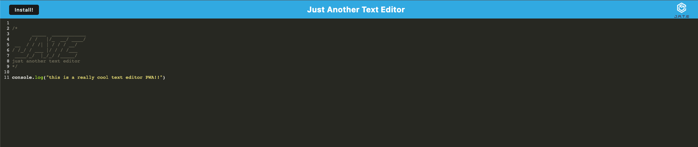

# Just Another Text Editor

  
  
  
  
  ## Description
  
  JATE is a PWA (Progressive Web App) that can be installed from the browser and will allow you to use the text editor both online and offline to write code!

    

  ## Table of Contents
  
  - [Installation](#installation)
  - [Usage](#usage)
  - [Credits](#credits)
  - [License](#license)

   
  
  ## Installation / Dependencies

      workbox, express, idb, babel

  
   

  ## Usage

  Access the PWA by clicking this [link](https://jate-texteditor1-5f61b91974cb.herokuapp.com/) and click install to use offline

   
  
  ## Credits

      Github: andyr-dev Email: andy3942@gmail.com
  
  ## License

  This project is licensed under the [MIT License](https://opensource.org/licenses/MIT) license.
  
   

  ## Badges

    

   
  
  ## Questions

  If you have any questions, please feel free to email me at andy3942@gmail.com

  [Link to my GitHub](https://github.com/andyr-dev/)
  
   

  ## How to Contribute

No contributions at this time

   
  
  ## Test
  N/A